# PHASE_2_DEPENDENCY_GRAPH.md — Subsystem Architecture & Dependency Ordering

> **Status**: Living Architecture Baseline (Post-Reconciliation Audit)  
> **Target Platform**: Windows 10/11 x64 Native Desktop (.NET 9.0)  
> **Purpose**: Visual and structural dependency ordering for Phase 2 implementation.

---

## 1. Master Subsystem Dependency Graph

```mermaid
flowchart TD
    subgraph S0["Stage 0: Parity Baseline & Spec"]
        P2A["Phase 2A: Parity Audit & Spec\n(docs/PHASE_2_*.md)"]
    end

    subgraph S1["Stage 1: Hardware Core (Physical Execution)"]
        P2B["Phase 2B: Core Dictation Parity\n- Real WASAPI Capture\n- Whisper AVX2 CPU + DirectML\n- Hands-Free Double-Tap\n- 20m Recording Ceiling"]
    end

    subgraph S2["Stage 2: Formatting & Personalization Engines"]
        P2C["Phase 2C: Smart Formatting & Backtrack\n- Multi-pass pipeline\n- Spoken punctuation\n- Bounded backtrack engine\n- Numbered lists"]
        P2D["Phase 2D: Personalization Engine (Backend)\n- SQLite storage (WAL mode)\n- Personal dictionary matching\n- Voice snippets expansion (4k)\n- Styles (Preserve/Expand/Contract)"]
    end

    subgraph SG["Reconciliation Gate"]
        PRG["Definitive Parity Reconciliation\n- 70 atomic capabilities cataloged\n- False completion downgrades\n- 6m vs 20m duration resolved\n- Backend vs UI separation"]
    end

    subgraph S3["Stage 3: Context & Command Productivity"]
        P2E["Phase 2E: Developer Mode & Context\n- UIA password field exclusion\n- UIA nearby text extraction\n- Spoken casing commands\n- Voice file tagging (@file.ts)\n- IDE terminal injection"]
        P2F["Phase 2F: Safe Command Mode\n- Secondary hotkey trigger\n- Selection-aware voice editing\n- Flow Bar Transforms widget\n- Zero-destructive invariant"]
    end

    subgraph S4["Stage 4: History & Native Desktop Hub"]
        P2G["Phase 2G: History, Search & Scratchpad\n- SQLite transcript logging\n- FTS5 instant full-text search\n- Paste-last-transcript hotkey\n- WPM, word count & streak\n- Floating Scratchpad window"]
        P2H["Phase 2H: Native Windows Hub & HUD Polish\n- WinUI 3 Fluent Hub window\n- Personal dictionary GUI tab\n- Voice snippets GUI tab\n- Styles & app-mapping GUI tab\n- History viewer & search GUI\n- Real-time HUD waveform meter\n- Settings & shortcut rebinding"]
    end

    subgraph S5["Stage 5: Hardening & Parity Verification"]
        P2I["Phase 2I: Privacy, DPAPI & Resilience\n- DPAPI database encryption\n- Windows startup registry\n- Audio endpoint crash recovery\n- Remote desktop (RDP) safety"]
        P2J["Phase 2J: Full Parity Physical Validation\n- 12-application physical matrix\n- Real microphone human dictation\n- Empirical latency & memory SLA\n- Final parity sign-off"]
    end

    P2A --> P2B
    P2B --> P2C
    P2B --> P2D
    P2C --> PRG
    P2D --> PRG
    PRG --> P2E
    P2E --> P2F
    P2D --> P2G
    P2F --> P2G
    P2G --> P2H
    P2D --> P2H
    P2B --> P2H
    P2H --> P2I
    P2I --> P2J

    classDef completed fill:#1a3a2a,stroke:#2ecc71,stroke-width:2px,color:#ffffff;
    classDef current fill:#2a3a5a,stroke:#3498db,stroke-width:2px,color:#ffffff;
    classDef pending fill:#222,stroke:#444,stroke-width:1px,color:#ddd;

    class P2A,P2B,P2C,P2D,PRG completed;
    class P2E current;
    class P2F,P2G,P2H,P2I,P2J pending;
```



---

## 2. Decoupled Architectural Layering

```
┌────────────────────────────────────────────────────────┐
│             Presentation Layer (WinUI 3 / XAML)        │
│  - Floating HUD Window (WS_EX_NOACTIVATE | TOPMOST)    │
│  - Real-Time Audio Waveform Visualizer (VU Meter)      │
│  - Main Hub Application Window (Mica / Fluent Design)   │
│    ├── Tab 1: Home & Dictation History                 │
│    ├── Tab 2: Personal Dictionary & Corrections        │
│    ├── Tab 3: Voice Snippets Manager                   │
│    ├── Tab 4: Writing Styles & App Mappings            │
│    ├── Tab 5: Desktop Scratchpad                       │
│    └── Tab 6: Settings, Shortcuts & Audio Devices      │
│  - System Tray NotifyIcon & Context Menu               │
└───────────────────────────┬────────────────────────────┘
                            │ Calls into
┌───────────────────────────▼────────────────────────────┐
│               Application Core (.NET 9 / C#)           │
│  - VoiceSessionCoordinator (Session State Machine)     │
│  - Multi-Pass TranscriptProcessingPipeline             │
│  - Personalization Engine (Dictionary, Snippets, Style)│
│  - Developer Casing & Token Shielding Engine           │
│  - HistoryRepository & FTS5 Search Engine              │
│  - Local SQLite Database (Microsoft.Data.Sqlite)       │
└─────────────┬────────────────────────────┬─────────────┘
              │ Depends on                 │ Depends on
┌─────────────▼──────────────┐┌────────────▼─────────────┐
│  Windows Integration Layer ││ Native Inference Engine  │
│  - GlobalHotkeyHook (Win32)││  - DirectML ONNX Runtime │
│  - WasapiAudioCapture      ││  - whisper.cpp AVX2 CPU  │
│  - WindowsTextInsertion    ││  - Energy / Silero VAD   │
│  - UI Automation Context   ││  - Local Model Storage   │
│  - DPAPI Encryption        ││                          │
└────────────────────────────┘└──────────────────────────┘
```
