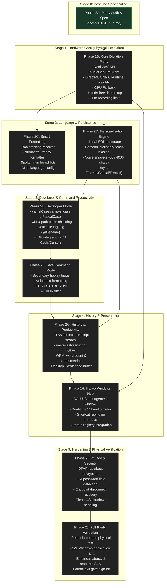

# PHASE_2_DEPENDENCY_GRAPH.md — Subsystem Architecture & Dependency Ordering

> **Status**: Active Architecture Baseline  
> **Target Platform**: Windows 10/11 x64  
> **Purpose**: Visual and structural dependency ordering for Phase 2 implementation.

---

## 1. Visual Dependency Graph



---

## 2. Layered Architecture Dependencies

The architecture maintains strict one-way dependency boundaries:

```
┌────────────────────────────────────────────────────────┐
│             Presentation Layer (WinUI 3)               │
│  - Floating HUD Window (WS_EX_NOACTIVATE | TOPMOST)    │
│  - Hub Management Window (Home, History, Settings)     │
│  - System Tray NotifyIcon & Context Menu               │
└───────────────────────────┬────────────────────────────┘
                            │ Calls into
┌───────────────────────────▼────────────────────────────┐
│               Core Services Layer (Flow.Core)          │
│  - VoiceSessionCoordinator (Session State Machine)     │
│  - ASREngineRegistry & Fallback Chain                  │
│  - DeterministicTextSanitizer & CasingTransformer      │
│  - BacktrackingResolver & ListFormattingEngine         │
│  - DictionaryManager, SnippetEngine & StyleManager     │
│  - HistoryRepository & FtsSearchEngine (SQLite)        │
└─────────────┬────────────────────────────┬─────────────┘
              │ Implements                 │ Uses
┌─────────────▼──────────────┐┌────────────▼─────────────┐
│  Windows Integration Layer ││ Native Inference Engine  │
│  - GlobalHotkeyHook (Win32)││  - DirectML ONNX Runtime │
│  - WasapiAudioCapture      ││  - whisper.cpp CPU fallback
│  - WindowsTextInsertion    ││  - Silero / Energy VAD   │
│  - UI Automation Context   ││  - Local weight store    │
└────────────────────────────┘└──────────────────────────┘
```

---

## 3. Strict Decoupling Rules

1. **Inference Isolation**: `Flow.Core` never directly imports DirectML or native ONNX C-APIs; all speech recognition goes through the `IASREngine` interface.
2. **Audio Capture Isolation**: `Flow.Core` receives standardized 16kHz float32 arrays or spans; it has zero knowledge of WASAPI or Windows Core Audio COM interfaces.
3. **Text Insertion Isolation**: Text injection is invoked via `ITextInsertionService`; the session coordinator is isolated from Win32 `SendInput`, `IUIAutomation`, or clipboard memory allocation.
4. **Safety Verification Invariant**: Both `DeterministicTextSanitizer` in Core and `WindowsTextInsertionService` in Host independently enforce the Zero-Enter and Zero-Unintended-Action filters.
