# WISPR_PARITY_COMPLETION_PLAN.md — FLOW Wispr Flow Parity Completion Plan

> **Authoritative Target**: Wispr Flow Windows Desktop Application (v1.5.x+ 2026 Baseline)  
> **Target Platform**: Windows 10/11 x64 Native Desktop  
> **Status**: Active Master Engineering Plan  
> **Mandate**: Complete all 69 Mandatory Parity Capabilities to at least Level 4 before Phase 3 AI features.

---

## 1. Current 75-Capability Inventory

FLOW tracks exactly 75 atomic capabilities across 12 functional domains and 1 out-of-scope domain:

| ID | Domain | Capability Name | Parity Class | Current Level | Module / Architecture |
| :--- | :--- | :--- | :--- | :--- | :--- |
| **WF-001** | Core Voice | Global Push-to-Talk (Right Alt) | Mandatory | **Level 5** | `GlobalHotkeyHook.cs` + `VoiceSessionCoordinator` |
| **WF-002** | Core Voice | Hands-Free Mode (Double-Tap) | Mandatory | **Level 5** | `GlobalHotkeyHook.cs` (350ms window) |
| **WF-003** | Core Voice | Session Cancellation (Escape) | Mandatory | **Level 5** | `GlobalHotkeyHook.cs` (`VK_ESCAPE`) |
| **WF-004** | Core Voice | WASAPI Audio Capture (16kHz mono) | Mandatory | **Level 5** | `WasapiAudioCapture.cs` |
| **WF-005** | Core Voice | Audio Ring Buffer Rollover (30s) | Mandatory | **Level 5** | `AudioRingBuffer.cs` |
| **WF-006** | Core Voice | Voice Activity Detection (VAD) | Mandatory | **Level 5** | `EnergyVAD.cs` (RMS energy + zero crossing) |
| **WF-007** | Core Voice | Microphone Device Selection | Mandatory | **Level 4** | `WasapiDeviceManager.cs` |
| **WF-008** | Core Voice | Desktop Recording Limit (20m/19m) | Mandatory | **Level 5** | `VoiceSessionCoordinator` timer |
| **WF-009** | Core Voice | Quiet / Whisper Audio Adaptation | Mandatory | **Level 4** | `EnergyVAD` adaptive noise floor |
| **WF-010A** | Core Voice | Auditory Feedback Cues | Mandatory | **Level 3** | Win32 `MessageBeep` feedback hook |
| **WF-010B** | Desktop UX | Sound Effects Toggle in Settings | Mandatory | **Level 1** | Settings schema mapped; pending Hub UI |
| **WF-011** | Transcription | Local Offline ASR Execution | Mandatory | **Level 5** | `WhisperNetInferenceEngine.cs` (AVX2 CPU) |
| **WF-012** | Transcription | ASR Fallback Escalation Chain | Mandatory | **Level 4** | `ASREngineRegistry.cs` |
| **WF-013** | Transcription | Automatic Capitalization | Mandatory | **Level 5** | `SmartCapitalizationStage.cs` |
| **WF-014** | Transcription | Terminal Punctuation | Mandatory | **Level 5** | `SpokenPunctuationStage.cs` |
| **WF-015** | Transcription | Spoken Punctuation Mapping | Mandatory | **Level 5** | `SpokenPunctuationStage.cs` |
| **WF-016** | Transcription | Filler Word Removal | Mandatory | **Level 5** | `ConservativeFillerRemovalStage.cs` |
| **WF-017** | Transcription | Zero-Enter Safety Invariant | Mandatory | **Level 5** | `WhitespaceAndZeroEnterStage.cs` |
| **WF-018** | Formatting | Desktop Backtracking & Correction | Mandatory | **Level 5** | `InsertionHistoryTracker.cs` |
| **WF-019** | Formatting | Spoken Numbered & Bulleted Lists | Mandatory | **Level 5** | `NumberedListStage.cs` |
| **WF-020A** | Formatting | Number, Date & Currency Norm | Mandatory | **Level 4** | `TechnicalEntityProtectionStage.cs` |
| **WF-020B** | Formatting | Auto Cleanup Levels | Mandatory | **Level 1** | Architecture mapped; pending Hub Style tab |
| **WF-020C** | Formatting | Undo AI Edit / Raw Revert | Mandatory | **Level 1** | History tracking mapped; pending Hub UI |
| **WF-021** | Multilingual | Manual Multi-Language Selection | Mandatory | **Level 4** | `WhisperModelManager.cs` (`ggml-tiny.bin`) |
| **WF-022** | Multilingual | Automatic Language Detection | Mandatory | **Level 4** | Whisper LID token auto-detection |
| **WF-023** | Multilingual | Code-Switching & Bilingual Audio | Mandatory | **Level 4** | Whisper prompt biasing adaptation |
| **WF-024A** | Personalization| Personal Dictionary Engine | Mandatory | **Level 4** | `SqlitePersonalDictionaryRepository.cs` |
| **WF-024B** | Personalization| Personal Dictionary Hub GUI | Mandatory | **Level 0** | WinUI 3 management table pending |
| **WF-025A** | Personalization| Custom Corrections Engine | Mandatory | **Level 4** | `PersonalDictionaryEngine.cs` |
| **WF-025B** | Personalization| Custom Corrections Hub GUI | Mandatory | **Level 0** | WinUI 3 corrections editor pending |
| **WF-026A** | Personalization| Voice Snippets Engine | Mandatory | **Level 5** | `SqliteSnippetRepository.cs` |
| **WF-026B** | Personalization| Voice Snippets Hub GUI | Mandatory | **Level 0** | WinUI 3 snippets editor pending |
| **WF-027A** | Personalization| Writing Styles Engine | Mandatory | **Level 4** | `SqliteStyleRepository.cs` |
| **WF-027B** | Personalization| Writing Styles Hub GUI | Mandatory | **Level 0** | WinUI 3 profile editor pending |
| **WF-028** | Personalization| Auto-Learned Vocabulary | Optional/Beta | **Level 0** | User correction frequency tracker |
| **WF-029** | Context | Active App Detection (HWND/PID) | Mandatory | **Level 4** | `WindowsTextInsertionService.cs` |
| **WF-030** | Context | Password Field Exclusion | Mandatory | **Level 5** | `WindowsUIAutomationContextService.cs` |
| **WF-031A** | Context | Nearby Context Extraction | Mandatory | **Level 5** | `WindowsUIAutomationContextService.cs` |
| **WF-031B** | Context | Contextual Routing | Mandatory | **Level 5** | `WindowsTextInsertionService.cs` |
| **WF-032A** | Developer Mode | Programmatic Casing Transforms | Mandatory | **Level 4** | `CasingTransformer.cs` |
| **WF-032B** | Developer Mode | Spoken Casing Triggers | Mandatory | **Level 4** | `SpokenCasingStage.cs` |
| **WF-033** | Developer Mode | Technical Identifier Shield | Mandatory | **Level 5** | `TechnicalEntityProtectionStage.cs` |
| **WF-034** | Developer Mode | Voice File Tagging (@filename) | Mandatory | **Level 4** | `VoiceFileTaggingStage.cs` |
| **WF-035** | Developer Mode | IDE & Terminal Compatibility | Mandatory | **Level 5** | `WindowsTextInsertionService.cs` |
| **WF-036** | Command Mode | Dedicated Shortcut Activation | Mandatory | **Level 4** | `GlobalHotkeyHook.cs` (`Ctrl+Right Alt`) |
| **WF-037A** | Command Mode | Selection-Aware Voice Transform | Mandatory | **Level 4** | `DeterministicTextTransformEngine.cs` |
| **WF-037B** | Command Mode | Flow Bar Transforms Widget | Optional/Beta | **Level 4** | `FloatingHudController.cs` |
| **WF-038** | Command Mode | Zero-Destructive Execution Safety | Mandatory | **Level 5** | `DeterministicCommandSafetyPolicy.cs` |
| **WF-039A** | History | SQLite Storage & FTS5 Search | Mandatory | **Level 1** | Schema mapped with FTS5 virtual table |
| **WF-039B** | History | Cancelled Dictation Recovery | Mandatory | **Level 1** | Aborted audio cache recovery mapped |
| **WF-040** | History | History Hub GUI | Mandatory | **Level 0** | WinUI 3 history viewer & search pending |
| **WF-041** | History | Paste-Last-Transcript Shortcut | Mandatory | **Level 1** | Replay shortcut mapped |
| **WF-042** | History | Productivity Statistics (WPM) | Mandatory | **Level 1** | Aggregator schema mapped |
| **WF-043A** | Scratchpad | Desktop Scratchpad Window | Mandatory | **Level 1** | Floating lightweight editor window mapped |
| **WF-043B** | Scratchpad | Direct Scratchpad Voice Dictate | Mandatory | **Level 1** | Non-activating voice insertion mapped |
| **WF-044A** | Desktop UX | Floating HUD Window (Win32) | Mandatory | **Level 3** | `FloatingHudController.cs` |
| **WF-044B** | Desktop UX | HUD Visual Waveform Meter | Mandatory | **Level 1** | Real-time VU-meter rendering pending |
| **WF-044C** | Desktop UX | HUD State Machine Transitions | Mandatory | **Level 3** | `FloatingHudController.cs` |
| **WF-045** | Desktop UX | System Tray NotifyIcon & Menu | Mandatory | **Level 4** | `TrayIconManager.cs` |
| **WF-046** | Desktop UX | Native Windows Hub Window | Mandatory | **Level 0** | WinUI 3 multi-tab application pending |
| **WF-047** | Desktop UX | Shortcut Customization | Mandatory | **Level 1** | Rebindable hotkey settings pending |
| **WF-048** | Desktop UX | Audio Device Feedback / Meter | Mandatory | **Level 1** | Real-time settings mic test meter pending |
| **WF-049** | Windows Integ | Dual-Tier Safe Text Insertion | Mandatory | **Level 5** | Tier 1 UIA, Tier 2 SendInput Ctrl+V |
| **WF-050** | Windows Integ | Per-Monitor V2 DPI Awareness | Mandatory | **Level 4** | `app.manifest` PerMonitorV2 verified |
| **WF-051** | Windows Integ | Run on Windows Startup | Mandatory | **Level 1** | `HKCU\...\Run` registry helper mapped |
| **WF-052** | Windows Integ | Graceful OS Shutdown / Cleanup | Mandatory | **Level 4** | `WM_QUERYENDSESSION` teardown tested |
| **WF-053A** | Windows Integ | Audio Endpoint Disconnect Recov | Mandatory | **Level 4** | `IMMNotificationClient` hot-swap tested |
| **WF-053B** | Windows Integ | Remote Desktop (RDP) Compat | Mandatory | **Level 4** | SendInput clipboard fallback tested |
| **WF-054** | Privacy | 100% Local In-Memory Audio | Mandatory | **Level 5** | Zero cloud audio streaming verified |
| **WF-055** | Privacy | Local Database DPAPI Encryption | Mandatory | **Level 1** | `ProtectedData` DPAPI integration mapped |
| **WF-056** | Privacy | Zero Telemetry Leaks | Mandatory | **Level 5** | Structured redaction in logs verified |
| **WF-OS-01**| Out of Scope | Cloud AI Meeting Notetaker | Out-of-Scope | **Level 0** | Excluded (Cloud meeting bot) |
| **WF-OS-02**| Out of Scope | iOS / Android Virtual Keyboards | Out-of-Scope | **Level 0** | Excluded (Mobile virtual keyboards) |
| **WF-OS-03**| Out of Scope | Multi-Tenant Cloud Team Sync | Out-of-Scope | **Level 0** | Excluded (Centralized cloud team sync) |
| **WF-OS-04**| Out of Scope | Cloud Telemetry & Audio Logging | Out-of-Scope | **Level 0** | Excluded (Cloud telemetry violation) |

---

## 2. 69 Mandatory Capabilities Verification

The 69 Mandatory capabilities represent the complete, non-negotiable functional surface of Wispr Flow on Windows 10/11 desktop:

$$	ext{Total Capabilities (75)} = 	ext{Mandatory (69)} + 	ext{Optional/Beta (2)} + 	ext{Out-of-Scope (4)}$$

* **Optional / Beta (2)**:
  * `WF-028`: Auto-Learned Vocabulary (frequency tracking of user corrections).
  * `WF-037B`: Flow Bar Transforms Widget (wand icon trigger; already Level 4).
* **Out-of-Scope (4)**:
  * `WF-OS-01`: Cloud AI Meeting Notetaker.
  * `WF-OS-02`: iOS / Android Virtual Keyboards.
  * `WF-OS-03`: Multi-Tenant Cloud Team Sync.
  * `WF-OS-04`: Cloud Telemetry & Audio Logging.

---

## 3. Current Maturity Breakdown

```text
Total Atomic Capabilities: 75
├── Mandatory: 69
├── Optional / Beta: 2
└── Out-of-Scope: 4

Maturity Distribution:
├── Level 0 (Not Present): 11
│   ├── Mandatory: 6 (WF-024B, WF-025B, WF-026B, WF-027B, WF-040, WF-046)
│   ├── Optional: 1 (WF-028)
│   └── Out-of-Scope: 4 (WF-OS-01, WF-OS-02, WF-OS-03, WF-OS-04)
├── Level 1 (Architecture / Contract Only): 14
│   └── Mandatory: 14 (WF-010B, WF-020B, WF-020C, WF-039A, WF-039B, WF-041, WF-042, WF-043A, WF-043B, WF-044B, WF-047, WF-048, WF-051, WF-055)
├── Level 2 (Synthetic / Mock): 0
├── Level 3 (Real Code, Unverified): 3
│   └── Mandatory: 3 (WF-010A, WF-044A, WF-044C)
├── Level 4 (Real Code, Unit/Integration Tested): 22
│   ├── Mandatory: 21
│   └── Optional: 1 (WF-037B)
└── Level 5 (Physical Desktop Verified): 25
    └── Mandatory: 25

Operational Baseline (Level 4 + Level 5): 47 / 75 (62.7%)
Mandatory Operational (Level 4 + Level 5): 46 / 69 (66.7%)
Mandatory Remaining to reach Level 4: 23 / 69 (33.3%)
```

---

## 4. Missing Functionality (Backend & Engines)

The following 12 functional/backend capabilities require real implementation or runtime integration:

1. **`WF-039A` — History SQLite Storage & FTS5 Search**:
   * Create `flow_history.db` repository using `Microsoft.Data.Sqlite`.
   * Implement FTS5 virtual table for full-text search across past dictation sessions.
   * Store timestamp, duration, WPM, process name, window title, raw transcript, clean transcript.
2. **`WF-039B` — Dismissed / Cancelled Dictation Recovery**:
   * Transient audio buffer cache for discarded sessions upon `Escape` cancellation.
   * Ability to recover and re-transcribe cancelled sessions from history.
3. **`WF-041` — Paste-Last-Transcript Global Shortcut**:
   * Replay last inserted transcript from `InsertionHistoryTracker` / history repository into active cursor.
4. **`WF-042` — Productivity Statistics Engine**:
   * Aggregate rolling WPM, total dictation duration, cumulative word counts, and daily active streak.
5. **`WF-043A` — Desktop Scratchpad Floating Window**:
   * Non-activating lightweight editor window summoned via dedicated global shortcut.
6. **`WF-043B` — Direct Scratchpad Voice Dictation & Markdown**:
   * Route voice dictation directly into scratchpad buffer without requiring OS focus change.
7. **`WF-051` — Run on Windows Startup**:
   * `HKCU\Software\Microsoft\Windows\CurrentVersion\Run` registry management helper with `--minimized` switch.
8. **`WF-055` — Local Database DPAPI Encryption**:
   * Encrypt sensitive database contents (or DB file encryption key) via `System.Security.Cryptography.ProtectedData`.
9. **`WF-010B` — Sound Effects Toggle Engine**:
   * Configuration flag in settings model to mute/enable audio feedback cues.
10. **`WF-020B` — Auto Cleanup Levels Engine**:
    * Dynamic pipeline configuration for Cleanup Levels: None (raw ASR), Light (fillers only), Medium (full formatting), High (aggressive clarity).
11. **`WF-020C` — Undo AI Edit / Raw Transcript Revert**:
    * Track raw vs cleaned transcript pairs in session coordinator to allow instant revert of last insertion.
12. **`WF-048` — Audio Input Device Meter Hook**:
    * Expose real-time RMS input amplitude stream for settings test meter.

---

## 5. Missing Production UI (Strict Maturity Standard)

Per Rule 9, **a backend engine is NOT a finished product feature**. The following desktop GUI surfaces are currently missing:

1. **`WF-046` — Native Windows Hub Window Shell**:
   * Modern Windows desktop dashboard (WinUI 3 / XAML) with navigation tabs: History, Dictionary, Snippets, Styles, Shortcuts, Audio/Settings, About.
2. **`WF-024B` — Personal Dictionary Hub GUI**:
   * DataGrid/ListView table to view, search, add, edit, delete custom dictionary terms; CSV/JSON import & export buttons.
3. **`WF-025B` — Custom Corrections Hub GUI**:
   * Management view to configure spoken-to-written mapping rules (*"term"* $
ightarrow$ *"replacement"*).
4. **`WF-026B` — Voice Snippets Hub GUI**:
   * Template editor: trigger phrase, rich template content (up to 4,000 characters), conflict indicator, active toggle.
5. **`WF-027B` — Writing Styles Hub GUI**:
   * Profile selector (Work, Personal, Email, Technical, Casual); contraction rules; application assignment dropdown.
6. **`WF-040` — History Hub GUI**:
   * Search bar with FTS5 live filtering, date range filters, transcript card list with copy-to-clipboard buttons.
7. **`WF-047` — Shortcut Customization UI**:
   * Keybinding capture controls to rebind Push-to-Talk, Hands-Free, Command Mode, Scratchpad, and Paste-Last-Transcript.
8. **`WF-048` — Audio Device Feedback / Meter UI**:
   * Interactive VU audio input meter in Settings to test microphone levels.
9. **`WF-044B` — HUD Visual Waveform Meter**:
   * Real-time animated waveform / VU indicator inside the floating HUD bar.
10. **`WF-010B` — Sound Effects Toggle UI**:
    * Settings toggle switch to mute or unmute audio cue sounds.
11. **`WF-020B` — Auto Cleanup Levels Selector UI**:
    * Radio buttons or dropdown in Settings / Styles tab to select default cleanup level.
12. **`WF-020C` — Undo AI Edit / Raw Revert UI**:
    * Revert button in HUD / tray menu to undo cleanup and restore raw transcript.

---

## 6. Dependency Graph & Architectural Flow

```mermaid
flowchart TD
    subgraph Data Layer
        WF039A["WF-039A: History SQLite & FTS5"]
        WF055["WF-055: DPAPI Local Encryption"]
    end

    subgraph Productivity Services
        WF039B["WF-039B: Cancelled Recovery"]
        WF041["WF-041: Paste Last Transcript"]
        WF042["WF-042: Productivity Stats"]
        WF020C["WF-020C: Undo AI Edit Revert"]
    end

    subgraph Scratchpad Subsystem
        WF043A["WF-043A: Scratchpad Window"]
        WF043B["WF-043B: Direct Scratchpad Dictation"]
    end

    subgraph Desktop Hub UI Shell
        WF046["WF-046: Native Windows Hub Window"]
        WF040["WF-040: History Hub GUI"]
        WF024B["WF-024B: Dictionary GUI"]
        WF025B["WF-025B: Corrections GUI"]
        WF026B["WF-026B: Snippets GUI"]
        WF027B["WF-027B: Styles GUI"]
        WF047["WF-047: Shortcut Customization UI"]
        WF048["WF-048: Audio Test Meter UI"]
        WF010B["WF-010B: Sound Toggle UI"]
        WF020B["WF-020B: Cleanup Level UI"]
    end

    subgraph OS Integration
        WF051["WF-051: Startup Registry Helper"]
        WF044B["WF-044B: HUD Waveform Meter"]
    end

    WF039A --> WF039B
    WF039A --> WF041
    WF039A --> WF042
    WF039A --> WF040
    WF039A --> WF020C
    WF039A --> WF055

    WF043A --> WF043B

    WF046 --> WF040
    WF046 --> WF024B
    WF046 --> WF025B
    WF046 --> WF026B
    WF046 --> WF027B
    WF046 --> WF047
    WF046 --> WF048
    WF046 --> WF010B
    WF046 --> WF020B
```



---

## 7. Implementation Order Across Groups A through K

The remaining 23 mandatory capabilities are organized into a strict dependency-aware backlog:

### Priority Batch 1: History, Search & Recovery Data Backbone (Immediate Target)
* **Rank 1: `WF-039A` — History SQLite Storage & FTS5 Search**
  * *Prerequisite for*: WF-039B, WF-041, WF-042, WF-040, WF-020C.
  * *Action*: Implement `SqliteDictationHistoryRepository` with FTS5 virtual table, migration, search queries.
* **Rank 2: `WF-041` — Paste-Last-Transcript Global Shortcut**
  * *Prerequisite*: WF-039A / `InsertionHistoryTracker`.
  * *Action*: Register global hotkey to re-insert most recent transcript into active window with Zero-Enter safety.
* **Rank 3: `WF-039B` — Dismissed / Cancelled Dictation Recovery**
  * *Prerequisite*: WF-039A + `AudioRingBuffer`.
  * *Action*: Retain last cancelled audio buffer in temporary disk cache; add restore method.
* **Rank 4: `WF-042` — Productivity Statistics Engine**
  * *Prerequisite*: WF-039A.
  * *Action*: Implement `ProductivityStatsAggregator` calculating WPM, word totals, daily streaks.

### Priority Batch 2: Desktop Scratchpad
* **Rank 5: `WF-043A` — Desktop Scratchpad Floating Window**
  * *Action*: Lightweight top-most non-activating text editor window summoned via shortcut.
* **Rank 6: `WF-043B` — Direct Scratchpad Voice Dictation & Markdown**
  * *Prerequisite*: WF-043A.
  * *Action*: Direct insertion into scratchpad buffer when scratchpad mode is triggered.

### Priority Batch 3: System Security & OS Integration
* **Rank 7: `WF-055` — Local Database DPAPI Encryption**
  * *Prerequisite*: WF-039A, WF-024A.
  * *Action*: Implement `DpapiEncryptionService` using Windows `ProtectedData` to secure DB tables/keys.
* **Rank 8: `WF-051` — Run on Windows Startup**
  * *Action*: Implement `WindowsStartupManager` using `HKCU\Software\Microsoft\Windows\CurrentVersion\Run`.

### Priority Batch 4: Native Windows Hub GUI & Settings
* **Rank 9: `WF-044B` — HUD Visual Waveform Meter**
  * *Action*: Wire dynamic RMS levels to Win32 HUD drawing loop for real-time waveform feedback.
* **Rank 10: `WF-046` — Native Windows Hub Window Shell**
  * *Prerequisite for*: All Hub GUIs.
  * *Action*: Create WinUI 3 / XAML host application with NavigationView tabs.
* **Rank 11: `WF-040` — History Hub GUI**
  * *Prerequisite*: WF-046, WF-039A.
  * *Action*: History list view, FTS5 search filter bar, date pickers, copy buttons.
* **Rank 12: `WF-024B` — Personal Dictionary Hub GUI**
  * *Prerequisite*: WF-046, WF-024A.
  * *Action*: Dictionary DataGrid, add/edit modal, CSV import/export.
* **Rank 13: `WF-025B` — Custom Corrections Hub GUI**
  * *Prerequisite*: WF-046, WF-025A.
  * *Action*: Spoken-to-written mapping editor.
* **Rank 14: `WF-026B` — Voice Snippets Hub GUI**
  * *Prerequisite*: WF-046, WF-026A.
  * *Action*: Snippets editor with conflict detection UI.
* **Rank 15: `WF-027B` — Writing Styles Hub GUI**
  * *Prerequisite*: WF-046, WF-027A.
  * *Action*: Style profile selector and per-application mapping dropdowns.
* **Rank 16: `WF-047` — Shortcut Customization UI**
  * *Prerequisite*: WF-046.
  * *Action*: Hotkey recording inputs for all global shortcuts.
* **Rank 17: `WF-048` — Audio Device Feedback / Meter in Settings**
  * *Prerequisite*: WF-046.
  * *Action*: Live input meter in Settings to test selected microphone.
* **Rank 18: `WF-010B` — Sound Effects Toggle in Settings**
  * *Prerequisite*: WF-046.
  * *Action*: Settings toggle switch.
* **Rank 19: `WF-020B` — Auto Cleanup Levels Selector UI**
  * *Prerequisite*: WF-046.
  * *Action*: Cleanup level selection control.
* **Rank 20: `WF-020C` — Undo AI Edit / Raw Revert UI**
  * *Prerequisite*: WF-046, WF-039A.
  * *Action*: Revert to raw transcript button in HUD and Hub.

### Priority Batch 5: Level 3 to Level 4/5 Hardening
* **Rank 21: `WF-010A` — Auditory Feedback Cues**: Add automated unit & integration tests.
* **Rank 22: `WF-044A` — Floating HUD Window (Win32)**: Add automated test harness for non-activating window styles.
* **Rank 23: `WF-044C` — HUD State Machine Transitions**: Add automated test harness for state transitions.

---

## 8. Testing Requirements

Every implemented capability must satisfy strict automated testing criteria:
1. **Repository / SQLite Tests**:
   * FTS5 query tokenization, prefix search (`word*`), exact match, and score ranking.
   * Transaction rollbacks on write failure.
   * Invariant: Zero memory leaks across 1,000 continuous insertions.
2. **Replay & Recovery Tests**:
   * `WF-041`: Verified text insertion into mock and real text controls without `VK_RETURN`.
   * `WF-039B`: Audio buffer integrity after cancellation.
3. **Statistics Tests**:
   * WPM accuracy: (words / minutes) calculated accurately across multi-session intervals.
   * Streak logic across midnight boundary transitions.
4. **Encryption Tests**:
   * `WF-055`: DPAPI roundtrip encrypt/decrypt; fail-closed behavior on corrupted bytes.
5. **Zero-Enter Invariant**:
   * Continuous automated assertion across all stages, snippets, and replay actions.

---

## 9. Physical Verification Requirements

Before upgrading any Level 4 capability to Level 5:
1. **Interactive Windows Desktop Validation**:
   * Test across target applications: Notepad, Windows Terminal, VS Code, Cursor, Visual Studio, Word.
2. **Audio Pipeline Physical Verification**:
   * Real WASAPI stream from physical hardware microphone array.
   * Verify audio feedback tones on physical speakers/headphones.
3. **UI Automation & Focus Verification**:
   * Confirm floating HUD and scratchpad never steal focus from target applications (`WS_EX_NOACTIVATE`).
4. **System Lifecycle Verification**:
   * Windows Startup registry entry verified via Task Manager Startup Apps tab.
   * Clean process shutdown without orphaned COM references or database locks.

---

## 10. Final Parity Gate Criteria

FLOW will be certified as achieving **Wispr Flow Windows Parity** ONLY when:
* [ ] All 69 Mandatory capabilities are verified at **Level 4 or Level 5**.
* [ ] Zero Mandatory capabilities remain at Level 0, Level 1, Level 2, or Level 3.
* [ ] Zero compiler warnings and zero compiler errors across the solution.
* [ ] 100% of automated test suites pass (target >450 passing tests).
* [ ] Zero P0 (safety-critical) and zero P1 (functional-blocker) defects remain.
* [ ] Physical desktop validation checklist completed across all supported Windows applications.
* [ ] Invariant check passed: Injected text NEVER contains `VK_RETURN` or triggers automated submissions.

**Only after satisfying all 7 gate criteria will Phase 3 (Differentiated AI Features) begin.**
